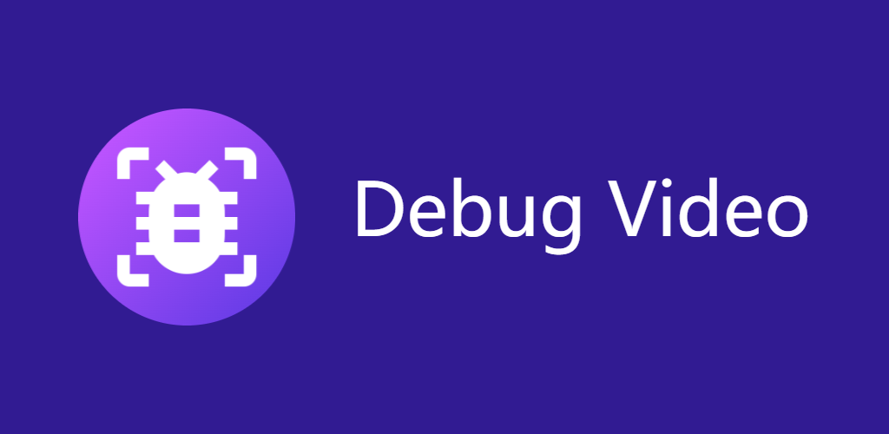

    <h1>my Debug VideoTV</h1>

    
    
卡是正常的，保持深呼吸

## 使用教程

### 下载

通过右侧release进行下载

### 安装

可以使用我们的姊妹项目[mytv-android](https://github.com/mytv-android/mytv-android)来安装（但你需要先安装它）

### Cookie填写

- 如需登录，需要在设置中填写Cookie，这需要在网页端中获取。你需要登录网页端（https://www.douyin.com ），并使用Chrome插件（例如https://chromewebstore.google.com/detail/cookie-editor/hlkenndednhfkekhgcdicdfddnkalmdm ），并从插件复制登录后的所有Cookie（就举例的插件而言，点击插件，点击右下角的Export，选择以“Header String”格式导出，图文并茂教程可以参考这里的第一步和第二步https://support-orig.hubstudio.cn/7794/e1fd ）.
- 不要在控制台使用``document.cookie``来获取，因为一些敏感Cookie不能被此方式获取到.
- 如果以上信息未能帮助到你，你还可以参考https://github.com/mytv-android/myDV/issues/25

### 操作方式

~~按到哪儿算哪儿吧~~

- 上下左右键移动焦点
- 返回键打开导航栏
- 在视频页使用左键/点击屏幕左部分显示视频推荐面板，右键/点击屏幕右部分显示进度条，继续点击左键或右键快进/快退视频
- 使用确认键/点击中间部分屏幕以暂停/播放视频
- 支持手势向左向右拖拽以快退/快进
- 连续按两次退出以退出应用

### 卸载

请在安装后24小时内卸载，因为这个项目不是用来在TV上刷视频的，只是告诉你AI写的代码有多厉害。

## 信息获取

可以来这个群里玩，虽然它是隔壁项目的群（懒得建新的了）

    

## 星标历史

## 著作权、许可证声明和致谢

- AI写的代码，也不知道它都抄了谁的代码，在此一并感谢了！
